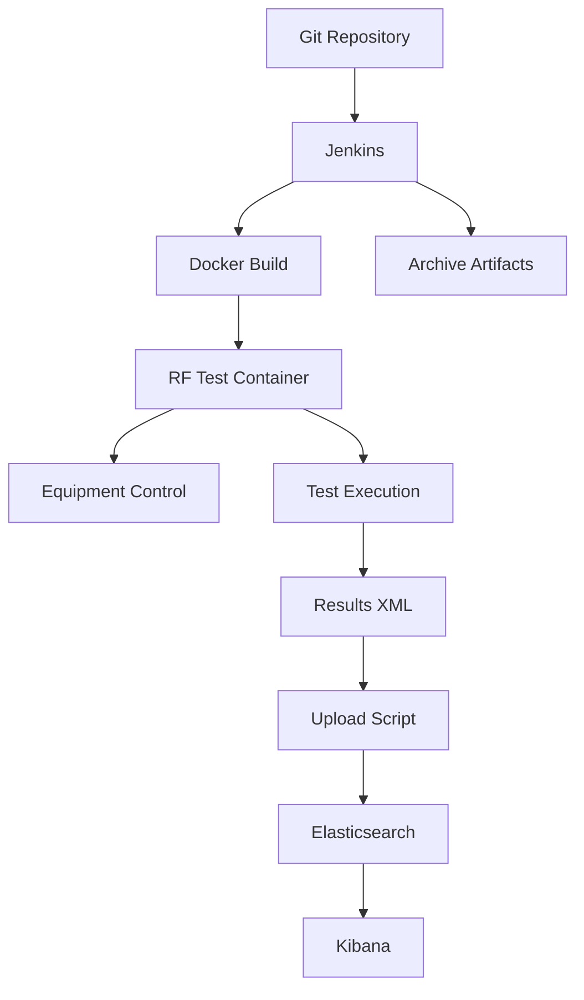

# System Architecture - RF Automation Infrastructure

Comprehensive architectural documentation for the RF automation system.

## Table of Contents

1. [Overview](#overview)
2. [System Components](#system-components)
3. [Network Architecture](#network-architecture)
4. [Software Stack](#software-stack)
5. [Data Flow](#data-flow)
6. [Security Considerations](#security-considerations)
7. [Scalability](#scalability)
8. [Technology Decisions](#technology-decisions)

---

## Overview

The RF Automation Infrastructure is an enterprise-grade test automation system designed for on-premise deployment. It orchestrates RF equipment testing using Robot Framework, with results stored in Elasticsearch for analysis via Kibana.

### Key Design Principles

- **Reliability**: Containerized execution ensures consistent test environments
- **Scalability**: Modular design allows adding equipment and tests easily
- **Traceability**: All test results stored with full metadata in Elasticsearch
- **Maintainability**: Infrastructure as Code (IaC) for reproducible deployments
- **Security**: Network segmentation isolates lab equipment from office network

---

## System Components

### Hardware Layer

```
┌─────────────────────────────────────────────────────────────┐
│                     Intel NUC Server                         │
│  ┌──────────────────────────────────────────────────────┐  │
│  │  CPU: Intel i7 (8 cores)                             │  │
│  │  RAM: 32GB DDR4                                      │  │
│  │  Storage: 1TB NVMe SSD                               │  │
│  │  Network: Dual Gigabit Ethernet                      │  │
│  └──────────────────────────────────────────────────────┘  │
└─────────────────────────────────────────────────────────────┘
```

**Resource Allocation**:
- Elasticsearch: 4GB heap (2GB min, 2GB max)
- Kibana: 1GB
- Jenkins: 2GB
- Docker containers: 8GB
- OS and overhead: 17GB

### Operating System Layer

**Ubuntu Server 24.04 LTS**
- Kernel: 6.x
- Init system: systemd
- Container runtime: Docker 24.x
- Native installation (no virtualization)

### Application Layer

#### 1. Jenkins (Orchestration)

- **Purpose**: CI/CD pipeline management
- **Port**: 8080
- **Installation**: Native (systemd service)
- **Storage**: `/var/lib/jenkins/`

**Responsibilities**:
- Trigger test execution
- Build Docker images
- Manage pipeline workflows
- Archive test artifacts
- Send notifications

#### 2. Docker Engine (Containerization)

- **Purpose**: Test environment isolation
- **Mode**: Host network mode for equipment access
- **Registry**: Docker Hub (public images)

**Managed Containers**:
- `rf-test-runner`: Robot Framework execution environment
- `elasticsearch`: Test results database
- `kibana`: Visualization dashboard

#### 3. Elasticsearch (Data Storage)

- **Purpose**: Time-series test results database
- **Port**: 9200 (HTTP), 9300 (Transport)
- **Deployment**: Docker container
- **Storage**: Named volume (`elasticsearch_data`)

**Index Strategy**:
```
rf-automation-{suite_name}-{YYYY.MM}
```

Example indices:
- `rf-automation-rf_functional-2026.02`
- `rf-automation-calibration-2026.02`

**Document Structure**:
```json
{
  "timestamp": "2026-02-23T10:30:00Z",
  "suite_name": "RF Functional Tests",
  "test_name": "TC001: Verify Equipment Connectivity",
  "status": "PASS",
  "duration": 12.5,
  "tags": ["connectivity", "smoke"],
  "build_number": 42,
  "branch": "main",
  "statistics": {
    "total": 10,
    "passed": 9,
    "failed": 1
  }
}
```

#### 4. Kibana (Visualization)

- **Purpose**: Dashboard and analytics
- **Port**: 5601
- **Deployment**: Docker container
- **Dashboards**: Custom RF test dashboards

**Key Visualizations**:
- Test pass/fail trends over time
- Equipment availability metrics
- Test duration analysis
- Failure categorization

#### 5. Robot Framework (Test Execution)

- **Purpose**: Test automation framework
- **Execution**: Inside Docker container
- **Libraries**: RequestsLibrary, SSHLibrary, custom RF libraries

---

## Network Architecture

### Dual Network Design

```
┌──────────────────────────────────────────────────────────────┐
│                        NUC Server                             │
│                                                               │
│  ┌─────────────────────┐         ┌──────────────────────┐   │
│  │   eth0 (Office)     │         │  eth1 (Lab VLAN)     │   │
│  │   DHCP/Static       │         │  192.168.50.5/24     │   │
│  └──────────┬──────────┘         └──────────┬───────────┘   │
│             │                               │               │
└─────────────┼───────────────────────────────┼───────────────┘
              │                               │
              │                               │
   ┌──────────▼────────────┐       ┌──────────▼──────────────┐
   │   Office Network      │       │     Lab VLAN            │
   │   Internet Access     │       │   192.168.50.0/24       │
   │   Git Repository      │       │   Isolated Network      │
   └───────────────────────┘       └─────────────────────────┘
                                              │
                                   ┌──────────┼──────────┐
                                   │          │          │
                            ┌──────▼───┐ ┌───▼────┐ ┌───▼────┐
                            │ Spectrum │ │ Signal │ │  DUT   │
                            │ Analyzer │ │  Gen   │ │        │
                            │ .50.10   │ │ .50.11 │ │ .50.20 │
                            └──────────┘ └────────┘ └────────┘
```

### Network Segmentation Benefits

1. **Security**: Lab equipment isolated from corporate network
2. **Performance**: Dedicated bandwidth for RF measurements
3. **Compliance**: Separate network for sensitive test equipment
4. **Reliability**: Test execution not affected by office network issues

### Docker Host Network Mode

**Why Host Network Mode?**

```yaml
# Standard bridge mode (NOT used)
docker run --network bridge ...
# Issues:
# - NAT required to reach equipment
# - Port mapping complexity
# - Potential performance impact

# Host network mode (USED)
docker run --network host ...
# Benefits:
# - Direct access to equipment IPs
# - No NAT overhead
# - Simple configuration
# - Better performance
```

**Trade-off**: Containers share host network namespace
- ✓ Simplicity and performance
- ✗ Less isolation between containers

**Acceptable** because:
- Single-user system (no multi-tenancy)
- Test containers are short-lived
- Equipment access requires host network

---

## Software Stack

### Technology Layers

```
┌────────────────────────────────────────────────────────┐
│              Presentation Layer                        │
│  ┌──────────────────┐         ┌──────────────────┐   │
│  │  Kibana          │         │  Jenkins UI      │   │
│  │  Dashboards      │         │  Pipeline View   │   │
│  └──────────────────┘         └──────────────────┘   │
└────────────────────────────────────────────────────────┘
                         │
┌────────────────────────────────────────────────────────┐
│           Application/Orchestration Layer              │
│  ┌──────────────────┐         ┌──────────────────┐   │
│  │  Jenkins         │         │  Robot Framework │   │
│  │  Pipeline Engine │────────▶│  Test Runner     │   │
│  └──────────────────┘         └──────────────────┘   │
└────────────────────────────────────────────────────────┘
                         │
┌────────────────────────────────────────────────────────┐
│               Data/Storage Layer                       │
│  ┌──────────────────┐         ┌──────────────────┐   │
│  │  Elasticsearch   │         │  File System     │   │
│  │  Time-series DB  │         │  Artifacts       │   │
│  └──────────────────┘         └──────────────────┘   │
└────────────────────────────────────────────────────────┘
                         │
┌────────────────────────────────────────────────────────┐
│              Equipment Control Layer                   │
│  ┌──────────────────┐  ┌──────────┐  ┌────────────┐  │
│  │ Spectrum         │  │ Signal   │  │    DUT     │  │
│  │ Analyzer         │  │ Gen      │  │            │  │
│  └──────────────────┘  └──────────┘  └────────────┘  │
└────────────────────────────────────────────────────────┘
```

### Component Dependencies



---

## Data Flow

### Test Execution Flow

**Step-by-step execution**:

1. **Trigger** (Manual or Scheduled)
   ```
   User clicks "Build Now" in Jenkins
   OR
   Git webhook triggers build
   OR
   Scheduled cron job
   ```

2. **Jenkins Pipeline Starts**
   ```
   Jenkinsfile executes:
   - Initialize stage
   - Build Docker image
   - Execute tests
   - Process results
   ```

3. **Docker Build**
   ```
   docker build -t rf-test-runner:${BUILD_NUMBER} .

   Includes:
   - Python 3.11
   - Robot Framework
   - Test scripts
   - Resource files
   ```

4. **Test Execution**
   ```
   docker run --rm --network host \
     -v ${RESULTS_DIR}:/app/results \
     rf-test-runner --outputdir results tests/

   Container:
   - Connects to equipment via SCPI
   - Executes Robot Framework tests
   - Generates output.xml, log.html, report.html
   ```

5. **Results Processing**
   ```
   Python script: upload_to_elastic.py

   - Parses output.xml
   - Extracts test results
   - Transforms to JSON
   - Bulk uploads to Elasticsearch
   ```

6. **Visualization**
   ```
   Kibana reads from Elasticsearch

   - Real-time dashboards
   - Historical trends
   - Custom queries
   ```

### Data Persistence

**Elasticsearch Storage**:
- Location: Named Docker volume
- Path: `/usr/share/elasticsearch/data`
- Backup: Snapshot/restore API

**Jenkins Artifacts**:
- Location: `/var/lib/jenkins/jobs/.../builds/*/archive/`
- Files: HTML reports, screenshots
- Retention: 30 builds

**Git Repository**:
- Source of truth for code
- Branch strategy: main, develop, feature/*

---

## Security Considerations

### Network Security

1. **VLAN Segmentation**
   - Lab equipment isolated from office network
   - No direct internet access from lab VLAN
   - NUC acts as controlled gateway

2. **Firewall Rules**
   ```bash
   # Allow Jenkins (from office network)
   ufw allow from 10.0.0.0/8 to any port 8080

   # Allow Kibana (from office network)
   ufw allow from 10.0.0.0/8 to any port 5601

   # Deny direct access to Elasticsearch (internal only)
   ufw deny 9200
   ```

3. **SSH Access**
   ```bash
   # Key-based authentication only
   PasswordAuthentication no

   # Restrict to office network
   AllowUsers automation@10.0.0.*
   ```

### Application Security

1. **Jenkins Security**
   - Authentication required
   - Role-based access control (RBAC)
   - Credentials stored encrypted

2. **Elasticsearch Security**
   - Currently: No authentication (internal network)
   - Production: Enable X-Pack security
   - API access restricted to localhost

3. **Docker Security**
   - Non-root user inside containers
   - Read-only root filesystem where possible
   - Resource limits (CPU, memory)

### Equipment Access Control

- Equipment accessible only from Lab VLAN
- No remote access to equipment from internet
- SCPI commands logged for audit

---

## Scalability

### Vertical Scaling

**Current Capacity**:
- Concurrent test execution: 1 suite at a time
- Elasticsearch storage: 1TB available
- Test retention: ~2 years of results

**Upgrade Path**:
- Add RAM: 32GB → 64GB (more concurrent tests)
- Add storage: 1TB → 2TB SSD (longer retention)
- CPU: Sufficient for current workload

### Horizontal Scaling

**Multi-Equipment Support**:
```python
# Easy to add more equipment
EQUIPMENT_LIST = {
    "SpectrumAnalyzer_1": "192.168.50.10",
    "SpectrumAnalyzer_2": "192.168.50.12",  # Add second SA
    "SignalGenerator_1": "192.168.50.11",
    "SignalGenerator_2": "192.168.50.13",   # Add second SG
    # ...
}
```

**Multi-Site Deployment**:
- Deploy separate stack at each lab site
- Centralize Elasticsearch (federated search)
- Single Kibana dashboard for all sites

---

## Technology Decisions

### Why Docker?

**Pros**:
- ✓ Consistent test environment
- ✓ Easy dependency management
- ✓ Fast startup/teardown
- ✓ Version control for environments

**Cons**:
- ✗ Slightly more complex than native
- ✗ Requires host network mode for equipment access

**Decision**: Benefits outweigh complexity

### Why Jenkins?

**Alternatives Considered**:
- GitLab CI/CD: Requires GitLab instance
- GitHub Actions: Requires cloud connectivity
- Cron + Scripts: Limited UI and scheduling

**Decision**: Jenkins provides best on-premise solution with rich plugin ecosystem

### Why Elasticsearch?

**Alternatives Considered**:
- PostgreSQL/MySQL: Poor time-series performance
- InfluxDB: Good for metrics, less flexible for complex queries
- MongoDB: Less mature time-series support

**Decision**: Elasticsearch excels at time-series data and full-text search

### Why Robot Framework?

**Alternatives Considered**:
- Pytest: Requires more Python coding
- Unittest: Less readable syntax
- Behave (BDD): Overhead for RF testing

**Decision**: Robot Framework's keyword-driven approach ideal for test engineers

---

## Diagrams

### Deployment Architecture

```
┌──────────────────────────────────────────────────────────┐
│                    Physical Layer                         │
│  ┌────────────────────────────────────────────────────┐  │
│  │             Intel NUC Hardware                     │  │
│  │  CPU: i7 | RAM: 32GB | Storage: 1TB SSD           │  │
│  └────────────────────────────────────────────────────┘  │
└──────────────────────────────────────────────────────────┘
                         │
┌──────────────────────────────────────────────────────────┐
│                  Operating System Layer                   │
│  ┌────────────────────────────────────────────────────┐  │
│  │          Ubuntu Server 24.04 LTS                   │  │
│  │  Docker Engine | systemd | Networking             │  │
│  └────────────────────────────────────────────────────┘  │
└──────────────────────────────────────────────────────────┘
                         │
┌──────────────────────────────────────────────────────────┐
│                  Application Layer                        │
│  ┌──────────┐  ┌──────────┐  ┌──────────┐  ┌─────────┐ │
│  │ Jenkins  │  │   ELK    │  │  Docker  │  │   Git   │ │
│  │ (Native) │  │(Container│  │   Test   │  │  Repo   │ │
│  │          │  │)         │  │ Runner   │  │         │ │
│  └──────────┘  └──────────┘  └──────────┘  └─────────┘ │
└──────────────────────────────────────────────────────────┘
                         │
┌──────────────────────────────────────────────────────────┐
│                Equipment Interface Layer                  │
│  ┌──────────────────────────────────────────────────┐   │
│  │    SCPI/HTTP Communication over Lab VLAN         │   │
│  └──────────────────────────────────────────────────┘   │
└──────────────────────────────────────────────────────────┘
```

---

**Document Version**: 1.0
**Last Updated**: 2026-02-23
**Next Review**: 2026-05-23
